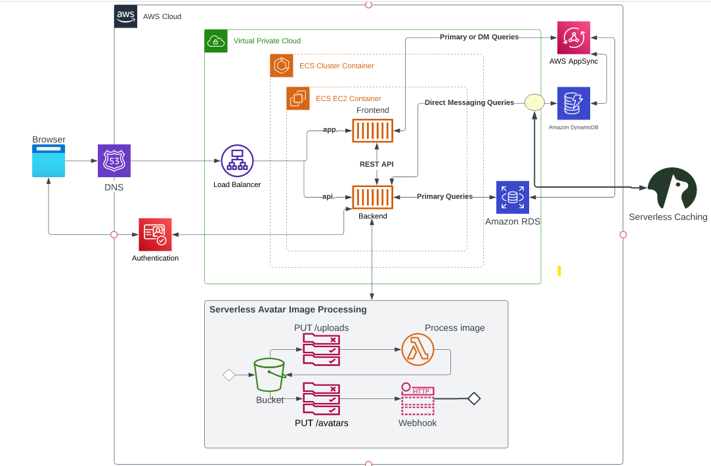
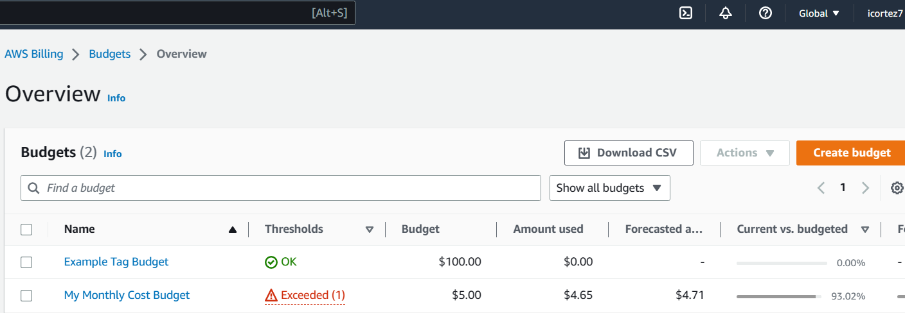
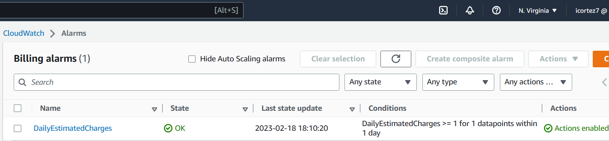
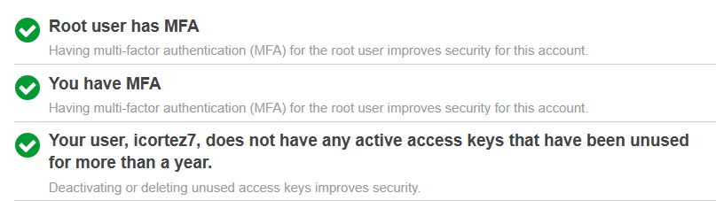

# Week 0 — Billing and Architecture

## Required Homework
### Recreate Conceptual Diagram in Lucid Charts or on a Napkin
This was my first time making a chart so I recreated Andrew's example on a napkin for extra points. Some of these terms were new to me and gave me the opportunity to do some research to visualize the process better.

### Recreate Logical Architectual Diagram in Lucid Charts
It took me 1.5 hours to recreate this chart because it requires a lot of detail to make it look neat and accurate. I was able to complete it and included the link below.

[Lucid Chart Share Link](https://lucid.app/lucidchart/cf193a4a-1cb8-4cb3-9b35-8d58af86c13f/edit?viewport_loc=-279%2C151%2C2560%2C1152%2C0_0&invitationId=inv_a960e4cd-2a73-46ab-b349-6edb297f56e6)

### Create a Budget
I customized the budget alarm for $5 because I had previous expenses from another project and wanted to keep track of my February spend.
 The code can also be found on my repo.

### Create a Billing Alarm
For the billing alarm, I set the suggested conditions and successfully created an alarm.
 The code can also be found on my repo.

## Homework Challenges
I completed the following challenge: Destroy your root account credentials, Set MFA, IAM role
 The image below is a screenshot of my IAM console.

