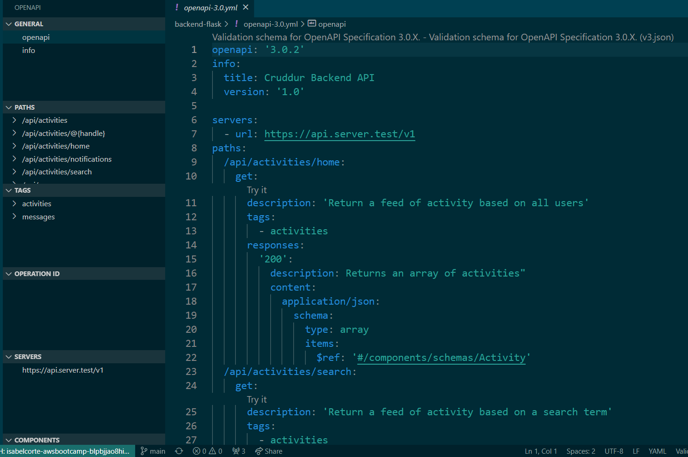
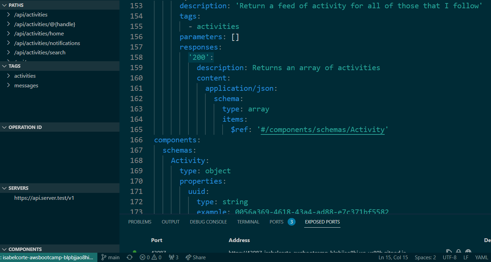
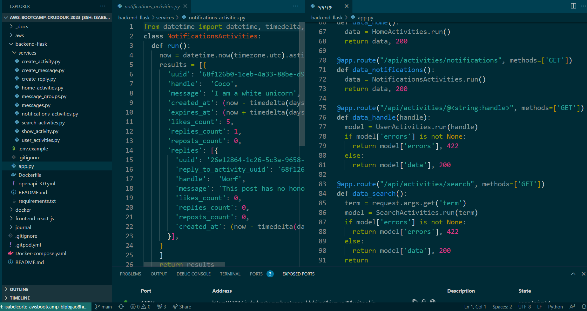
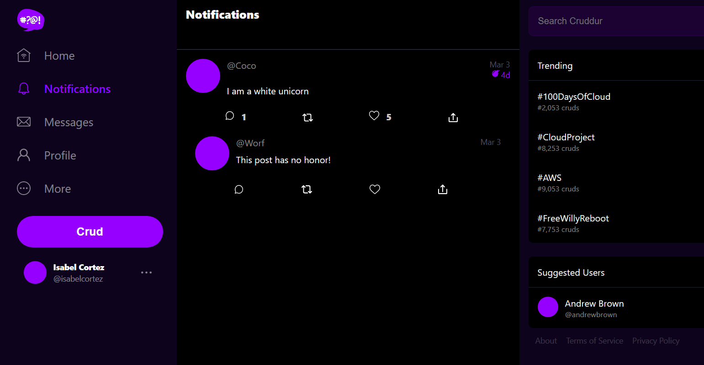

# Week 1 — App Containerization

## Required Homework
### 1.1 Containerize Application (Dockerfiles)
I start with the Dockerfile below:


Then, run Flask:
```
cd backend-flask
export FRONTEND_URL="*"
export BACKEND_URL="*"
python3 -m flask run --host=0.0.0.0 --port=4567
cd ..
```

Port 4567 should be running through Gitpod and once I unlock the port, I click on the URL and add ``` /api/activities/home ``` at the end.
The JSON code apprears as below:


To build the Docker container, I run the following command:
```
docker build -t  backend-flask ./backend-flask
```

You can see the steps of the container being built like layers. The last lines confirm the container was successfully built.


The ``` backend-flask ``` and ``` python ``` images were built and are seen by running the command ``` python images ``` as below:


Because the backend and frontend environment variables are already set in our local machine, I can run ``` docker run --rm -p 4567:4567 -it  -e FRONTEND_URL -e BACKEND_URL backend-flask ``` where ``` -e ``` will pipe them from my machine.

Port 4567 should be running through Gitpod and once I unlock the port, I click on the URL and add ``` /api/activities/home ``` at the end to see JSON

Next, run the following commands:
``` 
cd frontend-react-js
npm i 
cd ..
```

Then, I create a ``` Dockerfile ``` under ``` frontend-react-js ``` containing the following:
``` 
FROM node:16.18

ENV PORT=3000

COPY . /frontend-react-js
WORKDIR /frontend-react-js
RUN npm install
EXPOSE ${PORT}
CMD ["npm", "start"]
```
### 1.2 Containerize Application (Docker Compose)
First, I create a ``` docker-compose.yml ``` at the root of my project. With this, I am able to run multiple containers at the same time.


Then, I right-click on the newly created yml file and click the command compose up. It's basically doing a docker build and docker run on both of the containers.


I now see port 4567 and port 3000 running and make sure to unlock both of them.


I click the URL for port 3000 and see the Cruddur home page below. This means that the front end and back end are communicating and multiple containers are running.


### 2. Document the Notification Endpoint for the OpenAI Document
Here is where I am documenting:


If I go back to the Cruddur page, I can log in by using mock authentication. This is not connected to a database. Instead, it's running off of cookies.
Once I am logged in, I can see that all pages are completed, except the "Notifications" page. I begin by adding the notification endpoint ``` /api/activities/notifications ``` to the ``` openapi-3.0.yml ``` file as shown below:


    
### 3. Write a Flask Backend Endpoint for Notifications
I go to ``` backend-flask/app.py ``` to add the ``` @app.route("/api/activities/notifications", methods=['GET']) ``` Flask route. <br> 
I also add ```from services.notifications_activities import * ``` to the ```app.py``` file. <br>
Then, I create ``` notifications_activities.py ``` under ``` backend-flask/services ``` with the following code as shown below:



Port 4567 should be running through Gitpod and once I unlock the port, I click on the URL and add ``` /api/activities/notifications ``` at the end to see JSON

### Write a React Page for Notifications
I go to ``` frontend-react-js/src/App.js ``` and add ```import NotificationsFeedPage from './pages/NotificationsFeedPage'; ``` along with adding
```
{
path: "/notifications",
element: <NotificationsFeedPage />
},
```

Then, I create the files ``` NotificationsFeedPage.js ``` and ``` NotificationsFeedPage.css ``` under ``` frontend-react-js/src/pages ```

Next, we copy the contents of  ``` HomeFeedPage.js ``` and paste it into ``` NotificationsFeedPage.js ``` and change line 1 to ``` import './NotificationsFeedPage.css'; ```

I also changed line 23 to ``` const backend_url = '${process.env.REACT_APP_BACKEND_URL}/api/activities/notifications' ```

When I click on the Notifications tab on Cruddur, I can see the following which means we are done with the frontend!


