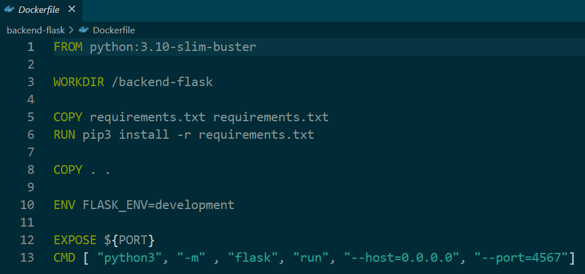
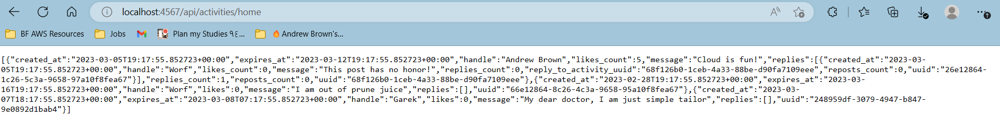
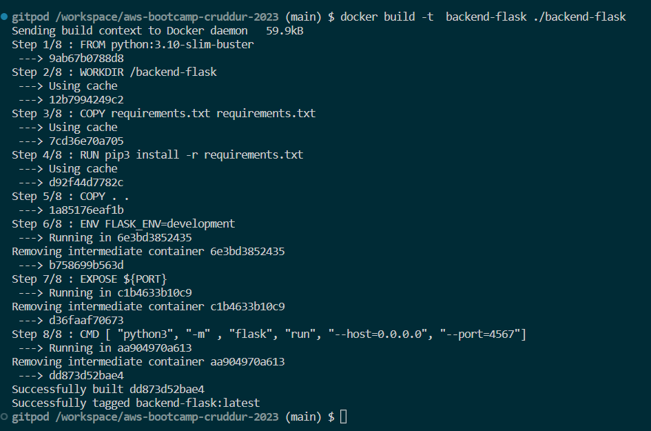
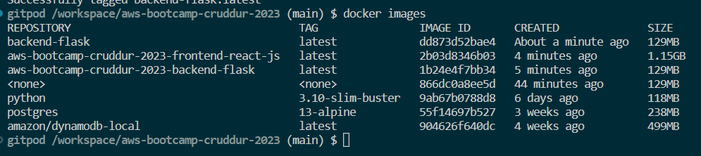
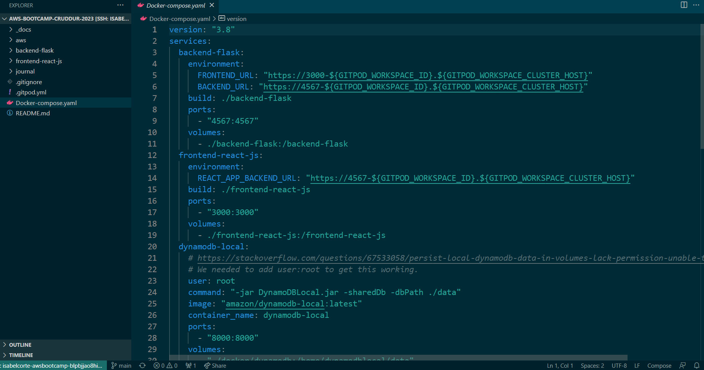
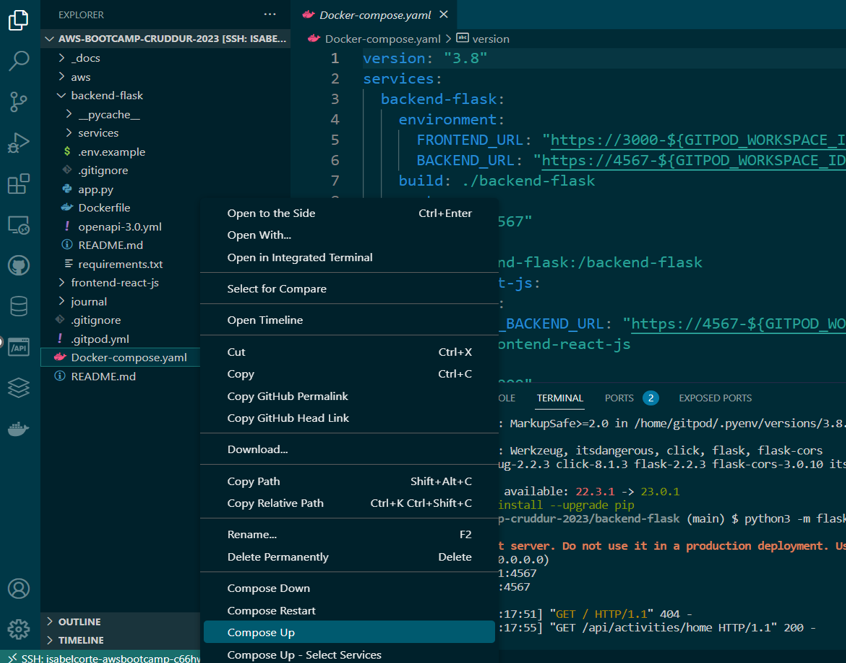
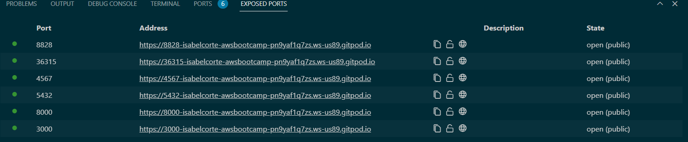
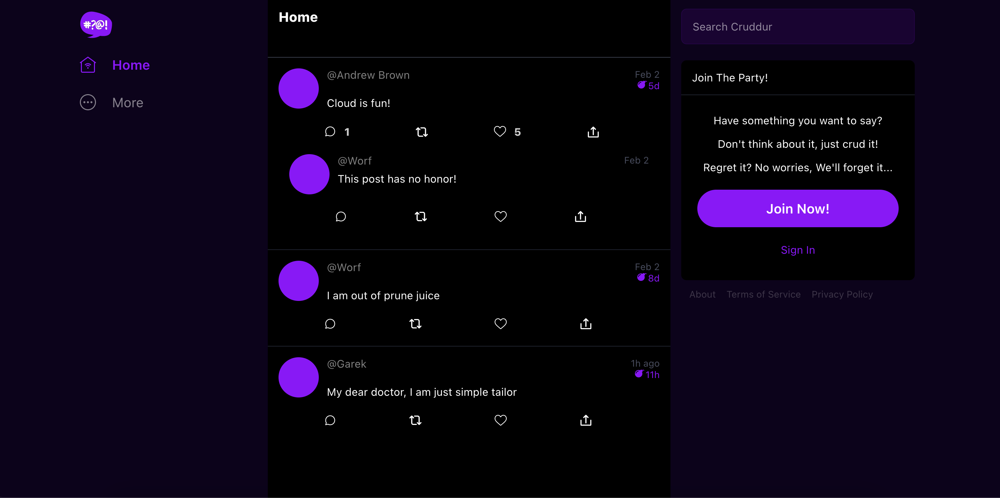

# Week 1 — App Containerization

## Required Homework
### 1.1 Containerize Application (Dockerfiles)
We start with the Dockerfile below:



Then, run Flask:
```
cd backend-flask
export FRONTEND_URL="*"
export BACKEND_URL="*"
python3 -m flask run --host=0.0.0.0 --port=4567
cd ..
```

Port 4567 should be running through Gitpod and once you unlock the port, you click on the URL and add ``` /api/activities/home ``` at the end.
You should see JSON as below:



To build the Docker container, run the following command:
```
docker build -t  backend-flask ./backend-flask
```

You can see the steps of the container being built like layers. The last lines confirm the container was successfully built.



The ``` backend-flask ``` and ``` python ``` images were built and are seen by running the command ``` python images ``` as below:



Because the backend and frontend environment variables are already set in our local machine, we can run ``` docker run --rm -p 4567:4567 -it  -e FRONTEND_URL -e BACKEND_URL backend-flask ``` where ``` -e ``` will pipe them from our machine.

Port 4567 should be running through Gitpod and once you unlock the port, you click on the URL and add ``` /api/activities/home ``` at the end to see JSON

Next, you want to run the following commands:
``` 
cd frontend-react-js
npm i 
cd ..
```

Then, create a ``` Dockerfile ``` under ``` frontend-react-js ``` containing the following:
``` 
FROM node:16.18

ENV PORT=3000

COPY . /frontend-react-js
WORKDIR /frontend-react-js
RUN npm install
EXPOSE ${PORT}
CMD ["npm", "start"]
```
### 1.2 Containerize Application (Docker Compose)
First, I created a ``` docker-compose.yml ``` at the root of my project. With this, we are able to run multiple containers at the same time.



Then, you right-click on the newly created yml file and click the command compose up. It's basically doing a docker build and docker run on both of the containers.



You should see port 4567 and port 3000 running. Make sure to unlock both of them.



If you click port 3000, you should see the home page below. This means that the front end and back end are communicating and multiple containers are running.


